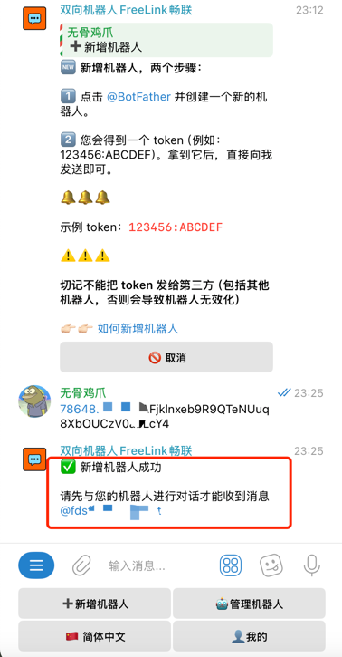
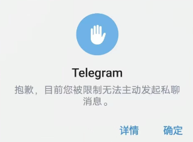

# 什么是双向机器人？

::: danger ❗️❗️❗️
很多小伙伴在使用Telegram的时候，都会遇到一个问题，就是无法给其他人发送消息，或者无法私聊别人。

(抱歉，目前您只能给双向联系人发送消息。)

(抱歉，目前您被限制无法主动发送私聊信息。)

那么我们要怎么解决这个问题呢
:::

## 为什么会被双向无法私聊？
造成这种情况最主要的原因是，这些小伙伴的Telegram账户，是使用中国手机号码，或者其他限制地区的手机号码注册的。

很多小伙伴在使用Telegram的时候，都会遇到一个问题，就是无法给其他人发送消息，或者无法私聊别人。

双向机器人是一个双向沟通工具，
